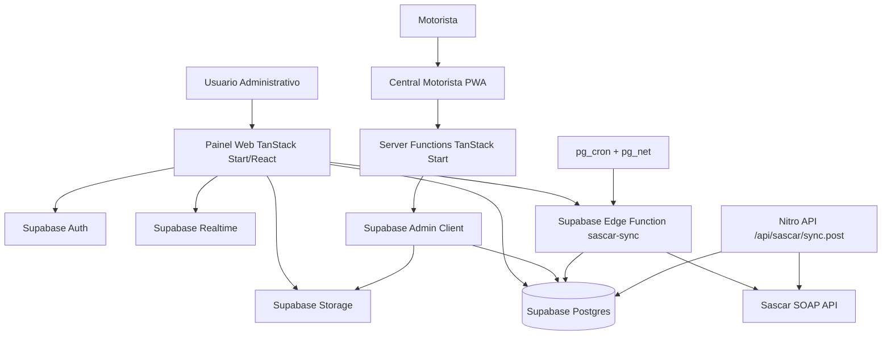
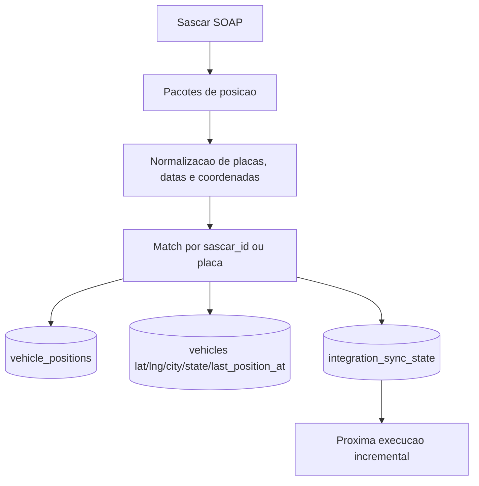
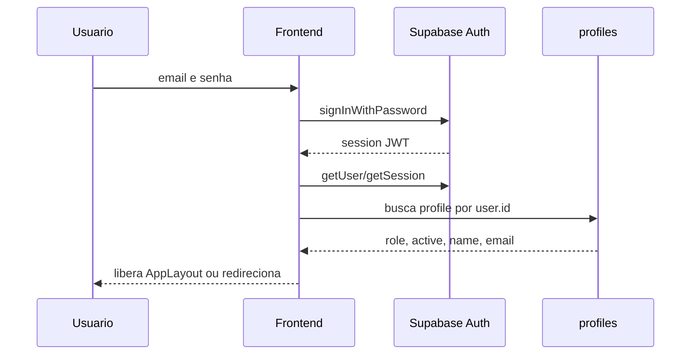
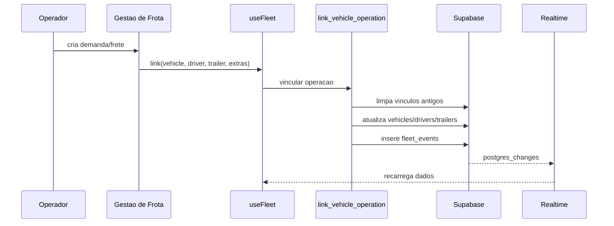
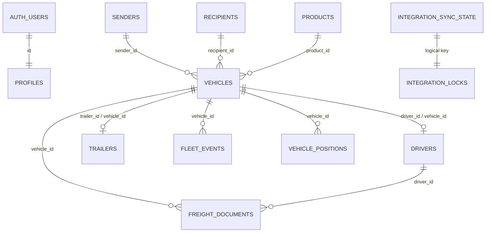
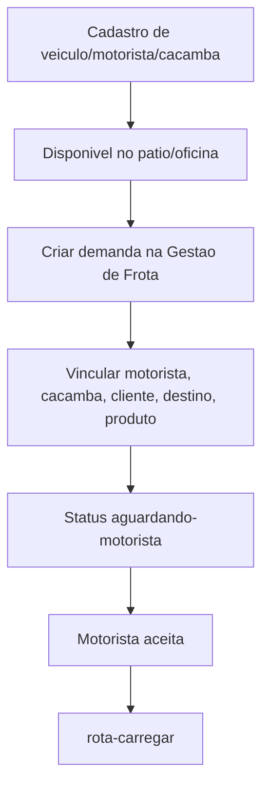
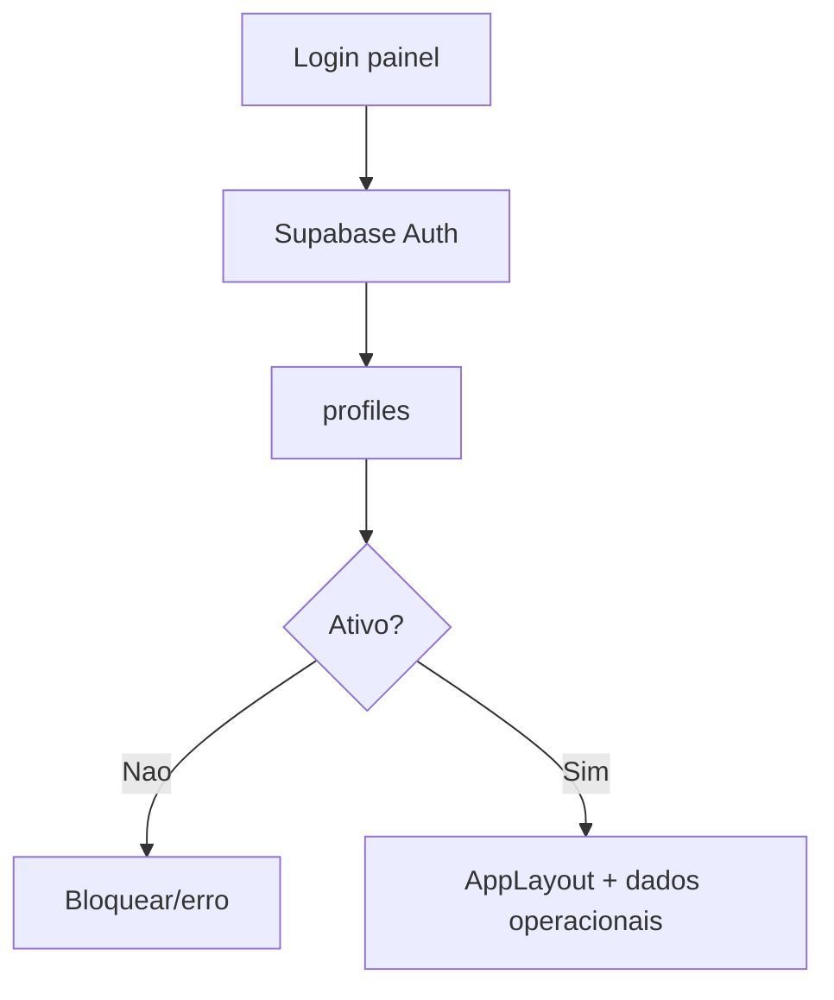
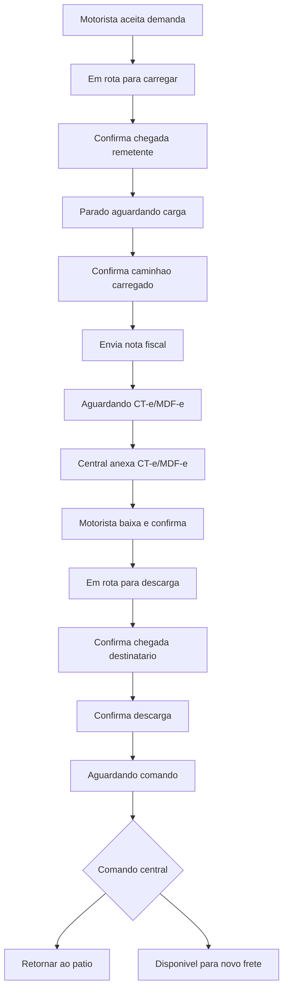
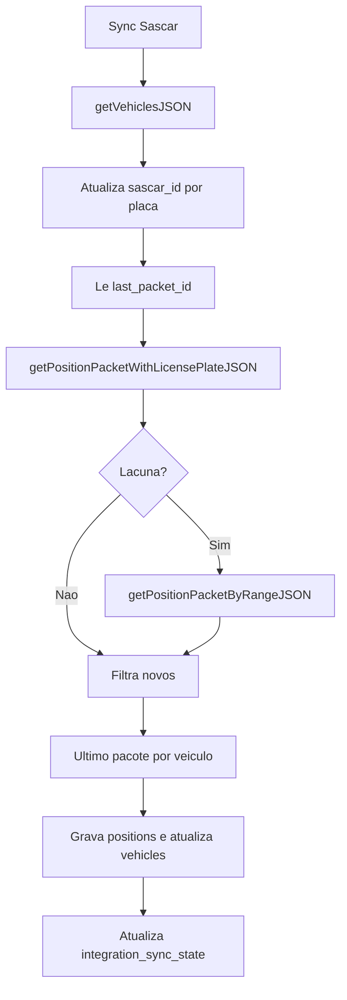
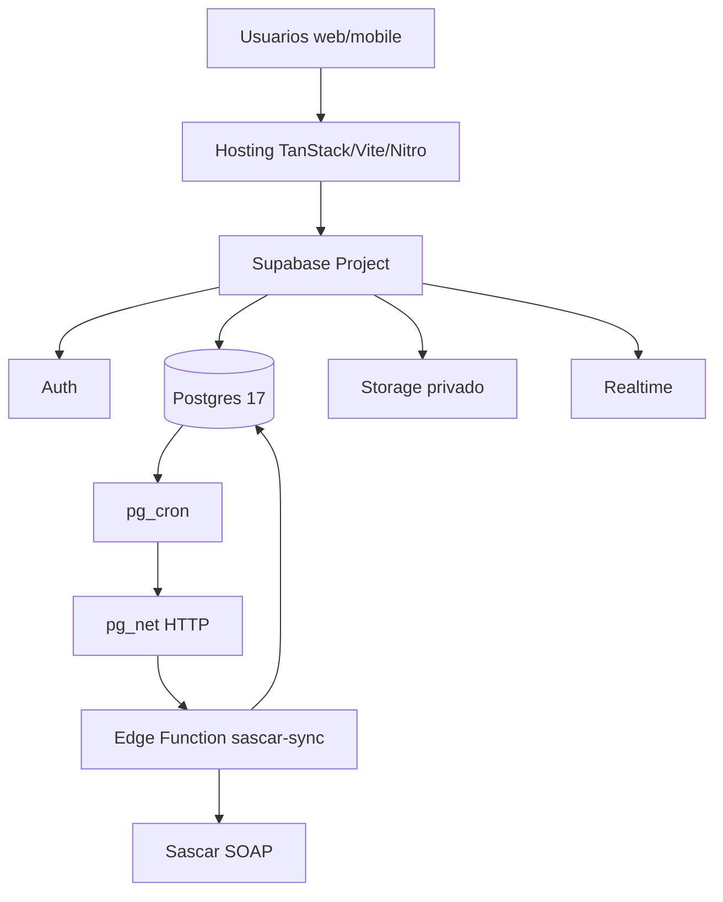

# Documentacao Tecnica Completa - Central Transportes e Servicos

## 1. Visao Geral Do Projeto

**Nome do projeto:** Central Transportes e Servicos - Sistema de Gestao de Frota, com subaplicacao **Central Motorista**.

**Objetivo principal:** controlar a operacao de frota rodoviaria, fretes, veiculos, motoristas, implementos/cacambas, clientes, documentos fiscais, mapa operacional e rastreamento Sascar em tempo quase real.

**Problema que resolve:** substitui controles manuais e dispersos por uma plataforma operacional integrada. O sistema centraliza a atribuicao de fretes, acompanha status de rota, armazena documentos, registra eventos, sincroniza posicoes de veiculos e permite que o motorista confirme etapas pelo app dedicado.

**Publico-alvo:** transportadoras, operadores logisticos, gestores de frota, equipe de expedicao, operadores de patio, motoristas e equipes administrativas.

**Beneficios da solucao:**

| Beneficio | Como o codigo entrega |
|---|---|
| Visibilidade operacional | Dashboard, mapa da frota, pipeline de fretes e historico em `fleet_events`. |
| Controle de ativos | CRUD de `vehicles`, `drivers`, `trailers`, `senders`, `recipients` e `products`. |
| Atualizacao em tempo real | Supabase Realtime em tabelas operacionais. |
| Rastreabilidade | Posicoes em `vehicle_positions`, eventos em `fleet_events` e documentos em `freight_documents`. |
| Integracao telematica | Edge Function `sascar-sync` e servicos SOAP Sascar. |
| Operacao em campo | App `central-motorista` com fluxo por etapas e upload de documentos. |
| Governanca | Supabase Auth, RLS, roles `admin`, `gestor` e `operador`. |

**Principais funcionalidades:**

- Login administrativo via Supabase Auth.
- Dashboard operacional.
- Gestao de fretes em pipeline.
- Cadastro e edicao de veiculos.
- Cadastro e edicao de motoristas.
- Cadastro e edicao de cacambas/implementos.
- Cadastro unificado de clientes, remetentes e destinatarios.
- Cadastro de produtos transportados.
- Vinculacao operacional entre veiculo, motorista, implemento, remetente, destinatario, produto e valor de frete.
- Mapa com posicoes e status de frota.
- Sincronizacao manual e automatica com Sascar.
- Historico de eventos operacionais.
- Upload e consulta de documentos fiscais/logisticos.
- PWA/app do motorista para aceitar demanda, confirmar etapas, anexar nota fiscal/comprovantes e reportar suporte.

**Diferenciais competitivos identificados no codigo:**

- Pipeline de frete com macroetapas e microetapas tipadas em `src/lib/freight-workflow.ts`.
- App de motorista isolado em `central-motorista/`, preparado para extracao para repositorio separado.
- Integracao Sascar com recuperacao por faixa de `packetId`, lock de concorrencia e cron no banco.
- Dados de frota enriquecidos por planilha/migrations, incluindo marca, modelo, ano, Renavam, tipo e modelo de implemento.
- Arquitetura serverless/Supabase com baixa necessidade de backend tradicional.

## 2. Arquitetura Geral



```mermaid
flowchart LR
  Routes[src/routes] --> Store[Zustand useFleet]
  Store --> Services[src/lib/services]
  Services --> SupabaseClient[@supabase/supabase-js anon]
  SupabaseClient --> Tables[(public tables)]
  SupabaseClient --> RPC[RPCs transacionais]
  Tables --> Realtime[postgres_changes]
  Realtime --> Store
```







**Camadas:**

| Camada | Responsabilidade |
|---|---|
| Frontend administrativo | Telas React em `src/routes`, layout, CRUD, pipeline e mapa. |
| Estado cliente | `src/lib/store.ts` com Zustand; agrega dados e assina Realtime. |
| Servicos cliente | `src/lib/services/*` encapsulam Supabase, RPCs e Storage. |
| Backend serverless | Supabase Postgres, Auth, Storage, Realtime, Edge Functions e RPCs PL/pgSQL. |
| App motorista | PWA em `central-motorista/` com server functions para operacoes com service role. |
| Integracao externa | Sascar SOAP por `getVehiclesJSON`, `getPositionPacketWithLicensePlateJSON`, `getPositionPacketByRangeJSON` e historico. |
| Jobs | `pg_cron` chama Edge Function a cada minuto. |

## 3. Estrutura De Pastas

```text
.
|-- src/
|   |-- assets/                  # Imagens referenciadas pelo app, como logo/favicon
|   |-- components/              # Componentes de tela e UI reutilizavel
|   |-- components/ui/           # Biblioteca visual baseada em Radix/shadcn
|   |-- hooks/                   # Hooks compartilhados
|   |-- lib/                     # Tipos, store, Supabase, auth, formatacao, workflows
|   |-- lib/services/            # Acesso a tabelas, RPCs e Storage
|   |-- lib/integrations/        # Cliente de integracao Sascar pelo frontend
|   |-- routes/                  # Rotas TanStack do painel principal
|   |-- routeTree.gen.ts         # Arquivo gerado pelo TanStack Router
|   |-- router.tsx               # Configuracao do roteador principal
|   `-- styles.css               # Estilos globais e tokens visuais
|-- server/
|   |-- api/sascar/sync.post.ts  # Endpoint Nitro para sync Sascar
|   `-- lib/                     # Cliente admin Supabase e logica Sascar Node
|-- supabase/
|   |-- migrations/              # Schema, policies, funcoes, cron e dados iniciais
|   |-- functions/sascar-sync/   # Edge Function Deno de sincronizacao Sascar
|   |-- seed.sql                 # Seed
|   `-- config.toml              # Config local Supabase
|-- central-motorista/
|   |-- src/routes/              # Rotas do app motorista
|   |-- src/components/driver/   # Componentes mobile/PWA do motorista
|   |-- src/lib/server/          # Operacoes server-side com service role
|   |-- public/manifest.webmanifest
|   `-- vite.config.ts
|-- scripts/                     # Scripts Node para sincronizacao/importacao de planilha
|-- package.json
|-- vite.config.ts
|-- wrangler.jsonc
|-- tsconfig.json
`-- README.md
```

## 4. Stack Tecnologica

| Categoria | Tecnologia | Papel no sistema |
|---|---|---|
| Frontend | React 19 | Interface do painel e app motorista. |
| Framework | TanStack Start / Router | SSR/rotas file-based e server functions. |
| Estado | Zustand | Store global `useFleet`. |
| Dados cliente | Supabase JS | Auth, Postgres, Storage, Realtime e Functions. |
| Banco | Supabase Postgres 17 | Fonte de verdade transacional. |
| Auth | Supabase Auth | Login administrativo com JWT. |
| Realtime | Supabase Realtime | Atualizacao por `postgres_changes`. |
| Storage | Supabase Storage | Bucket privado `freight-documents`. |
| Server runtime | Nitro | API server-side e build target. |
| Edge | Supabase Edge Functions (Deno) | Job `sascar-sync`. |
| Cron | pg_cron + pg_net | Disparo automatico da Edge Function. |
| UI | Tailwind CSS 4, Radix UI, lucide-react | Design system e componentes acessiveis. |
| Formularios | react-hook-form, zod | Dependencias disponiveis para validacao/formularios. |
| Mapas | Leaflet | Mapa da frota. |
| Graficos | Recharts | Visualizacoes do dashboard. |
| Deploy | Vite/TanStack/Nitro, Cloudflare config, Vercel preset no app motorista | Build e hospedagem. |

Nao ha implementacao de filas ou cache dedicado no codigo atual.

## 5. Dependencias

**Dependencias criticas do app principal:**

| Dependencia | Funcao |
|---|---|
| `@supabase/supabase-js` | Cliente de Auth, Postgres, Storage, Functions e Realtime. |
| `@tanstack/react-start` | Framework full-stack/SSR. |
| `@tanstack/react-router` | Roteamento file-based. |
| `@tanstack/react-query` | Query client no app motorista e base para dados assicronos. |
| `zustand` | Estado global do painel principal. |
| `nitro` | Runtime/API server-side. |
| `leaflet` / `@types/leaflet` | Mapa. |
| `lucide-react` | Iconografia. |
| `tailwindcss`, `@tailwindcss/vite`, `tailwind-merge`, `clsx` | Estilos utilitarios e composicao de classes. |
| `@radix-ui/*` | Componentes acessiveis. |
| `sonner` | Toasts. |
| `date-fns` | Datas. |
| `zod`, `react-hook-form`, `@hookform/resolvers` | Validacao/formularios. |
| `recharts` | Graficos. |

**Dev dependencies relevantes:** TypeScript, Vite, ESLint, Prettier, Supabase CLI, plugin Lovable para TanStack/Vite.

O app `central-motorista` repete a maior parte da stack, sem `zustand` e sem `leaflet`, com foco em PWA/mobile e server functions.

## 6. Modelagem Do Banco De Dados

### Diagrama ER



### Tabelas

| Tabela | Objetivo | Campos principais | PK/FK/Indices |
|---|---|---|---|
| `profiles` | Perfil e autorizacao de usuarios Auth. | `id uuid`, `name`, `email`, `role`, `active`, timestamps. | PK/FK `id -> auth.users`; RLS; trigger `touch_updated_at`. |
| `drivers` | Motoristas. | `id`, `name`, `phone`, `cnh`, `active`, `vehicle_id`, `fleet_seq`, `partner_role`, timestamps. | PK; FK `vehicle_id -> vehicles`; indice unico parcial `drivers_vehicle_id_unique`. |
| `trailers` | Implementos/cacambas. | `id`, `identifier`, `type`, `vehicle_id`, `fleet_seq`, `fleet_kind`, `brand`, `model`, `manufacture_year`, `renavam`, `implement_type`, `implement_model`. | PK; `identifier unique`; FK `vehicle_id`; indices por `renavam`, `implement_type`, `implement_model`. |
| `senders` | Remetentes/clientes origem. | `id`, `name`, `cnpj`, `city`, `state`, `active`, timestamps. | PK; RLS. |
| `recipients` | Destinatarios/clientes destino. | Mesmo shape de `senders`. | PK; RLS. |
| `products` | Produtos transportados. | `id`, `name`, `active`, timestamps. | PK; unique index `lower(name)`; Realtime publicado. |
| `vehicles` | Frota motora e estado operacional atual. | `id`, `plate`, `type`, `status`, `vehicle_situation`, `freight_stage`, `driver_id`, `trailer_id`, `sender_id`, `recipient_id`, `product_id`, `freight_value`, `city`, `state`, `lat`, `lng`, `sascar_id`, `last_position_at`, metadados de frota. | PK; `plate unique`; FKs para driver/trailer/sender/recipient/product; indices por status, situation, freight_stage, plate, driver, trailer, product. |
| `fleet_events` | Linha do tempo operacional. | `id`, `vehicle_id`, `status`, `freight_stage`, `city`, `state`, `source`, `description`, `created_by`, `event_type`, `action_origin`, `lat`, `lng`, `related_document_id`, `metadata`, `timestamp`. | PK; FK `vehicle_id`; FK `created_by -> auth.users`; indices por vehicle e timestamp. |
| `vehicle_positions` | Historico georreferenciado. | `id`, `vehicle_id`, `lat`, `lng`, `city`, `state`, `speed`, `direction`, `source`, `raw_payload`, `recorded_at`. | PK; FK `vehicle_id`; indices por vehicle e `recorded_at desc`. |
| `freight_documents` | Metadados de documentos anexados. | `id`, `vehicle_id`, `driver_id`, `kind`, `source`, `file_name`, `storage_bucket`, `storage_path`, `mime_type`, `size_bytes`, `status`, `metadata`, timestamps. | PK; FKs para vehicles/drivers; indices por vehicle, driver e kind; bucket privado. |
| `integration_sync_state` | Estado incremental de integracoes. | `key`, `last_packet_id`, `synced_at`, `metadata`, timestamps. | PK `key`; RLS; publicado para leitura autenticada/admin conforme migrations. |
| `integration_locks` | Lock transacional de integracao. | `key`, `locked_until`, timestamps. | PK; funcoes `acquire_integration_lock` e `release_integration_lock`; acesso revogado para anon/authenticated. |
| `integration_cron_settings` | Configuracao do cron Sascar. | `key`, `value`, timestamps. | PK; acesso revogado para anon/authenticated. |

### Checks e dominios relevantes

- `profiles.role`: `admin`, `operador`, `gestor`.
- `vehicles.status` e `fleet_events.status`: `disponivel-patio`, `disponivel-oficina`, `aguardando-motorista`, `rota-carregar`, `rota-descarregar`, `rota-retornando`, `parado-aguardando-carga`, `aguardando-cte`, `aguardando-confirmacao`, `parado-aguardando-comando`, `parado-descarregando`, `parado-quebrado`, `manutencao`.
- `vehicles.vehicle_situation`: `disponivel-patio`, `disponivel-oficina`, `em-rota`, `parado`, `quebrado`, `manutencao`.
- `vehicles.freight_stage`: `DISPONIVEL`, `EM_ROTA_CARREGAR`, `AGUARDANDO_NOTA`, `NOTA_EM_CONFERENCIA`, `NOTA_APROVADA_AG_CTE`, `CTE_GERADA_AG_CONFIRMACAO_MOTORISTA`, `EM_ROTA_ENTREGA`, `ENTREGUE_AG_FINALIZACAO`, `ENTREGA_FINALIZADA`.
- `freight_documents.kind`: `nota_fiscal`, `cte`, `cte_mdfe`, `comprovante_descarga`, `balanca`, `recibo`, `canhoto`, `comprovante_entrega`.
- `freight_documents.source`: `motorista_app`, `gestao_central`, `sistema`.

## 7. Regras De Negocio

| Regra | Implementacao |
|---|---|
| Apenas usuario autenticado le dados operacionais. | Policies RLS de select para `authenticated`. |
| Escrita operacional no schema principal exige role operacional. | `can_write_operational()` aceita `admin`, `gestor`, `operador`. |
| Exclusao em tabelas centrais e perfis e restrita a admin nas migrations iniciais. | Policies `admins can delete...`. |
| Veiculo tem no maximo um motorista e um implemento. | Indices unicos parciais em `vehicles.driver_id`, `vehicles.trailer_id`, `drivers.vehicle_id`, `trailers.vehicle_id`. |
| Vinculacao operacional deve limpar conflitos anteriores. | RPC `link_vehicle_operation` desvincula driver/trailer de outros veiculos antes de vincular. |
| Toda mudanca de status gera evento. | RPC `set_vehicle_status` insere em `fleet_events`; app motorista tambem insere eventos. |
| Posicao atual do veiculo reflete a ultima posicao gravada. | `register_vehicle_position`, sync Sascar e app motorista atualizam `vehicles.lat/lng/last_position_at`. |
| Manutencao/oficina usa coordenada fixa de Pedra Branca/SE em funcoes de status. | RPCs `set_vehicle_status` nas migrations. |
| Demanda de motorista so aparece se houver veiculo atribuido e frete/cliente associado. | `loadDriverDemandByPhone`. |
| Motorista precisa aceitar demanda antes de avancar. | `performDriverAction(ACEITAR_DEMANDA)` exige status disponivel/aguardando e stage `DISPONIVEL`. |
| Nota fiscal so pode ser enviada apos confirmar carregamento. | `uploadDriverDocument` valida `parado-aguardando-carga` e evento `caminhao_carregado_confirmado`. |
| CT-e/MDF-e precisa existir para motorista confirmar recebimento e ir descarregar. | `CONFIRMAR_RECEBIMENTO_CTE` exige documento `cte` ou `cte_mdfe`. |
| Descarga finaliza frete e deixa aguardando comando. | `CONFIRMAR_DESCARGA` muda para `parado-aguardando-comando` e `ENTREGA_FINALIZADA`. |
| Retorno ao patio so pode ser confirmado apos comando de retorno. | `CONFIRMAR_CHEGADA_PATIO` exige `rota-retornando`. |
| Sync Sascar nao pode rodar simultaneamente. | Edge Function usa `acquire_integration_lock`; implementacao Node tem `inFlight`. |
| Sync Sascar ignora pacotes sem GPS e posicoes mais antigas. | `gps !== 0` e comparacao com `last_position_at`. |

## 8. APIs

### Supabase PostgREST/Tables usadas pelo frontend

O painel usa Supabase JS diretamente para CRUD:

| Recurso | Operacoes |
|---|---|
| `vehicles` | list, upsert, delete. |
| `drivers` | list, upsert, delete. |
| `trailers` | list, upsert, delete. |
| `senders` | list, upsert, delete. |
| `recipients` | list, upsert, delete. |
| `products` | list, upsert, delete. |
| `fleet_events` | list. |
| `freight_documents` | list, insert, update status. |
| `vehicle_positions` | insert via RPC. |
| `integration_sync_state` | leitura do estado Sascar. |

### RPCs

| Metodo | Nome | Objetivo | Parametros | Resposta/erros |
|---|---|---|---|---|
| POST RPC | `set_vehicle_status` | Atualizar status/stage/situacao e registrar evento. | `p_vehicle_id`, `p_status`, `p_source`, `p_description`, `p_freight_stage`, em versoes recentes tambem `p_lat`, `p_lng`, `p_created_by`. | Retorna linha de `vehicles`; erro se veiculo nao existe ou sem permissao em versoes com `can_write_operational`. |
| POST RPC | `link_vehicle_operation` | Vincular veiculo a motorista, carreta, remetente, destinatario, produto e valor. | `p_vehicle_id`, `p_driver_id`, `p_trailer_id`, `p_sender_id`, `p_recipient_id`, `p_product_id`, `p_freight_value`. | Retorna `vehicles`; erro sem permissao ou veiculo inexistente. |
| POST RPC | `register_vehicle_position` | Inserir posicao e atualizar posicao atual do veiculo. | `p_vehicle_id`, `p_lat`, `p_lng`, `p_city`, `p_state`, `p_speed`, `p_direction`, `p_source`, `p_raw_payload`. | `void`; erro sem permissao. |
| POST RPC | `acquire_integration_lock` | Lock para jobs de integracao. | `p_key`, `p_ttl_seconds`. | `boolean`. |
| POST RPC | `release_integration_lock` | Libera lock. | `p_key`. | `void`. |
| POST RPC | `invoke_sascar_sync_cron` | Dispara HTTP para Edge Function via `pg_net`. | nenhum. | request id bigint/null. |

### Endpoint Nitro

**POST `/api/sascar/sync`** (`server/api/sascar/sync.post.ts`)

Objetivo: executar sincronizacao Sascar pelo runtime Node/Nitro.

Headers:

- `Authorization: Bearer <SASCAR_SYNC_TOKEN>` se `SASCAR_SYNC_TOKEN` estiver configurado.

Body:

```json
{
  "quantity": 3000,
  "forceFull": false,
  "includeCurrentHistory": false
}
```

Resposta:

```json
{
  "ok": true,
  "stats": {
    "quantityRequested": 3000,
    "sascarVehicles": 0,
    "vehicleBindingsUpdated": 0,
    "packetsFetched": 0,
    "packetsApplied": 0,
    "currentPositionsChecked": 0,
    "currentPositionsApplied": 0,
    "currentPositionErrors": 0,
    "syncedVehicles": 0,
    "skippedPackets": 0,
    "lastPacketIdBefore": null,
    "lastPacketIdAfter": null
  }
}
```

Erros: `401 Unauthorized`, `409` se ja estiver em andamento, `500` para falhas gerais/Sascar/Supabase.

### Supabase Edge Function

**POST `/functions/v1/sascar-sync`** (`supabase/functions/sascar-sync/index.ts`)

Objetivo: sincronizacao Sascar em producao e cron.

Headers:

- Cron: `x-sascar-sync-token`.
- Manual: `Authorization` com JWT valido; o usuario precisa ter profile ativo e role `admin`, `gestor` ou `operador`.

Body:

```json
{
  "quantity": 3000,
  "forceFull": false,
  "source": "manual"
}
```

Resposta: `{ "ok": true, "stats": ... }`.

Erros: `405 Method not allowed`, `401 Unauthorized`, `409` lock em andamento, `500` falha.

### Server Functions Do App Motorista

| Funcao | Metodo | Objetivo | Input |
|---|---|---|---|
| `fetchDriverDemand` | POST | Buscar demanda ativa por telefone. | `{ phone }` |
| `transitionDriverDemand` | POST | Executar acao operacional do motorista. | `{ phone, action, location?, metadata? }` |
| `uploadDriverFreightDocument` | POST | Upload de documento em base64 e criacao de registro. | `{ phone, kind, fileName, mimeType?, sizeBytes?, base64, location? }` |

## 9. Autenticacao E Seguranca

- **JWT/Sessoes:** Supabase Auth com `persistSession`, `autoRefreshToken` e `detectSessionInUrl`.
- **Perfis:** tabela `profiles` vinculada a `auth.users`; trigger `ensure_profile` cria perfil ao criar usuario.
- **Roles:** `admin`, `gestor`, `operador`.
- **RLS:** habilitado nas tabelas publicas principais; leitura por autenticados; escrita operacional via policies/funcoes.
- **Service role:** usado apenas server-side em `server/lib/supabase-admin.ts`, `central-motorista/src/lib/server/supabase-admin.ts` e Edge Function. Nunca deve ser exposto ao browser.
- **Storage:** bucket `freight-documents` privado; signed URLs expiram em 1 hora.
- **Token de sync:** `SASCAR_SYNC_TOKEN` protege cron/manual em rotas que nao dependem somente de JWT.
- **Concorrencia:** lock de integracao evita execucoes simultaneas.
- **Observacao importante:** o arquivo `.env` local contem segredos e nao deve ser versionado. Para apresentacao, usar apenas nomes de variaveis, nunca valores.

Nao ha evidencia no codigo de multi-tenant por empresa. A modelagem atual e single-tenant por projeto Supabase.

## 10. Fluxos Operacionais









## 11. WebSockets E Tempo Real

O projeto usa Supabase Realtime, nao WebSocket customizado.

**Canal principal:** `fleet-operational-data` em `src/lib/store.ts`.

**Eventos recebidos:** `postgres_changes` com `event: "*"`.

**Tabelas assinadas no frontend:**

- `vehicles`
- `drivers`
- `trailers`
- `senders`
- `recipients`
- `products`
- `fleet_events`
- `freight_documents`
- `vehicle_positions`

**Canal adicional:** `sascar-sync-state` na tela `mapa`, observando estado de sincronizacao.

**Estrategia:** ao receber alteracao, o store aguarda 250 ms e recarrega todos os dados operacionais (`loadAll`) para manter consistencia.

## 12. Servicos Internos

| Servico/arquivo | Funcao |
|---|---|
| `src/lib/services/vehicles.ts` | CRUD de veiculos, status e vinculacao via RPC. |
| `drivers.ts`, `trailers.ts`, `parties.ts`, `products.ts` | CRUD de cadastros. |
| `fleet-events.ts` | Lista eventos recentes. |
| `positions.ts` | Registra posicao via RPC. |
| `freight-documents.ts` | Lista, assina URL, envia e atualiza documentos. |
| `server/lib/sascar.ts` | Cliente SOAP Sascar Node. |
| `server/lib/sascar-sync.ts` | Orquestracao de sync Sascar Node/Nitro. |
| `supabase/functions/sascar-sync/index.ts` | Orquestracao de sync Sascar em Edge Function. |
| `central-motorista/src/lib/server/driver-operations.ts` | Busca demanda, executa transicoes e upload de documentos do motorista. |
| `scripts/import-fleet-spreadsheet-metadata.mjs` | Atualiza metadados de frota de `.output/fleet-import.json`. |
| `scripts/sync-fleet-from-spreadsheet.mjs` | Sincroniza frota/motoristas com planilha, removendo extras. |

**Cron Jobs:** `sascar-sync-every-minute` executa `select public.invoke_sascar_sync_cron();` a cada minuto.

## 13. Infraestrutura



**Componentes de infraestrutura identificados:**

- Supabase local/remoto configurado em `supabase/config.toml`.
- Edge Function `sascar-sync` com `verify_jwt = false`, mas autorizacao propria no codigo.
- PostgreSQL 17.
- `pg_cron`, `pg_net`, `pgcrypto`.
- Build Vite/TanStack Start/Nitro.
- Config `wrangler.jsonc` para Cloudflare, embora `vite.config.ts` esteja com `cloudflare: false`.
- App motorista com preset Nitro `vercel` quando `process.env.VERCEL` existe; caso contrario `node-server`.

Nao ha Dockerfile ou docker-compose no repositorio.

## 14. Escalabilidade

**Gargalos atuais:**

- `useFleet.loadAll()` recarrega todas as colecoes em cada evento Realtime.
- Realtime em muitas tabelas dispara reload global.
- Sync Sascar processa lotes de ate 3000 pacotes e insere/atualiza em loop.
- Historico de `vehicle_positions` pode crescer rapidamente sem particionamento/retencao.
- App motorista autentica por telefone + codigo fixo `1234` em modo demonstracao.
- Policies de `freight_documents` e `products` estao mais permissivas que o padrao role-based inicial.

**Melhorias sugeridas:**

| Prioridade | Acao |
|---|---|
| Critico | Remover codigo fixo do app motorista e implementar autenticacao real/OTP por motorista. |
| Critico | Rotacionar segredos expostos localmente e garantir `.env` fora do versionamento. |
| Importante | Trocar reload global por atualizacao incremental no store a partir do payload Realtime. |
| Importante | Criar retencao/particionamento de `vehicle_positions`. |
| Importante | Inserir/upsert posicoes Sascar em batch quando possivel. |
| Importante | Reforcar RLS de documentos/produtos com `can_write_operational()` e/ou escopo por motorista. |
| Opcional | Criar camada de observabilidade com logs estruturados e dashboards. |
| Opcional | Separar `central-motorista` em repositorio/deploy proprio. |

## 15. Monitoramento

**Implementacao atual:**

- Estado da ultima sincronizacao Sascar em `integration_sync_state`.
- Metadata da sync inclui origem, pacotes buscados/aplicados, veiculos sincronizados e skips.
- Logs via `console.warn`/`console.error` no frontend/server.
- App motorista tem captura basica de erros SSR em `error-capture.ts` e pagina de erro customizada.
- Edge Function retorna erros HTTP estruturados.

**Nao encontrado no codigo:**

- APM dedicado.
- Alertas automatizados.
- Dashboards de metricas.
- Log estruturado centralizado.
- Health checks.

## 16. Guia De Instalacao

### Pre-requisitos

- Node.js 20+
- npm
- Supabase CLI
- Projeto Supabase local ou remoto
- Credenciais Sascar para sync real

### Painel principal

```bash
npm install
cp .env.example .env
npm run dev
```

Variaveis:

```env
VITE_SUPABASE_URL=
VITE_SUPABASE_ANON_KEY=
SUPABASE_URL=
SUPABASE_ANON_KEY=
SUPABASE_SERVICE_ROLE_KEY=
SASCAR_WSDL_URL=
SASCAR_USER=
SASCAR_PASSWORD=
SASCAR_SYNC_TOKEN=
```

Banco local:

```bash
supabase start
supabase db reset
```

Banco remoto:

```bash
supabase link --project-ref <project-ref>
supabase db push
supabase db seed
```

Configurar secrets da Edge Function:

```bash
supabase secrets set SUPABASE_URL=... SUPABASE_ANON_KEY=... SUPABASE_SERVICE_ROLE_KEY=... SASCAR_WSDL_URL=... SASCAR_USER=... SASCAR_PASSWORD=... SASCAR_SYNC_TOKEN=...
```

Configurar cron:

```sql
insert into public.integration_cron_settings (key, value)
values
  ('sascar_function_url', 'https://<project-ref>.supabase.co/functions/v1/sascar-sync'),
  ('sascar_sync_token', '<token>')
on conflict (key) do update set value = excluded.value;
```

Build:

```bash
npm run build
npm run preview
```

### App motorista

```bash
cd central-motorista
npm install
npm run dev
```

Durante desenvolvimento, `central-motorista/vite.config.ts` carrega o `.env` da pasta pai.

## 17. Guia Para Novos Desenvolvedores

**Por onde comecar:**

1. Leia `README.md` e este documento.
2. Entenda o schema em `supabase/migrations`.
3. Veja os tipos de dominio em `src/lib/types.ts`.
4. Entenda o store em `src/lib/store.ts`.
5. Leia `src/lib/freight-workflow.ts` para o pipeline.
6. Para app motorista, comece por `central-motorista/src/lib/server/driver-operations.ts`.

**Padroes usados:**

- Rotas por arquivo com TanStack Router.
- Services finos para Supabase.
- RPCs para operacoes transacionais.
- UI baseada em componentes reutilizaveis e lucide icons.
- Estado global centralizado em Zustand no painel.
- Server-side service role apenas em funcoes/servidor.

**Boas praticas locais:**

- Nunca expor `SUPABASE_SERVICE_ROLE_KEY` no frontend.
- Toda nova regra transacional deve preferir RPC ou server function.
- Ao adicionar tabela operacional, considerar RLS, indices, Realtime e mappers.
- Ao adicionar novo status/stage, atualizar migrations, `types.ts`, `freight-workflow.ts`, app motorista e UI.
- Para documentos, usar bucket `freight-documents` e signed URLs.

## 18. Roadmap Tecnico

| Horizonte | Prioridade | Item |
|---|---|---|
| Curto prazo | Critico | Implementar autenticacao real para motorista; remover `DEMO_CODE`. |
| Curto prazo | Critico | Rotacionar chaves e validar que `.env` nao esta versionado. |
| Curto prazo | Importante | Ajustar RLS de `freight_documents` e `products` para roles operacionais. |
| Curto prazo | Importante | Adicionar testes de regras de fluxo do motorista e RPCs principais. |
| Medio prazo | Importante | Atualizacao incremental no store Realtime. |
| Medio prazo | Importante | Politica de retencao/particionamento para posicoes. |
| Medio prazo | Importante | Observabilidade: logs estruturados, metricas de sync e alertas de falha Sascar. |
| Medio prazo | Opcional | Consolidar API de sync para evitar duplicidade Node/Edge. |
| Longo prazo | Importante | Multi-tenant se a solucao for vendida para multiplas empresas. |
| Longo prazo | Opcional | Filas/worker dedicado para integracoes externas de maior volume. |
| Longo prazo | Opcional | Separar app motorista em deploy/repositorio proprio com pipeline independente. |

## 19. Resumo Executivo

O sistema Central Transportes e Servicos e uma plataforma de gestao de frota e fretes conectada ao Supabase. Ele oferece painel administrativo, pipeline operacional, mapa com rastreamento Sascar, cadastros de frota/clientes/produtos, documentos fiscais e um PWA para motoristas executarem a viagem em campo.

A arquitetura usa React/TanStack Start no frontend, Supabase como backend principal, Postgres com RLS e RPCs para regras transacionais, Storage privado para documentos, Realtime para atualizacao operacional e Edge Function com cron para sincronizacao Sascar. O app motorista roda separado dentro do repositorio e acessa dados com server functions usando service role.

Os principais diferenciais sao a integracao telematica, a rastreabilidade por eventos e documentos, o fluxo guiado para motoristas e a modelagem operacional ja aderente a fretes rodoviarios. Os proximos passos tecnicos mais importantes sao endurecer autenticacao do motorista, reforcar seguranca de policies, melhorar observabilidade e otimizar Realtime/sync para escala.

